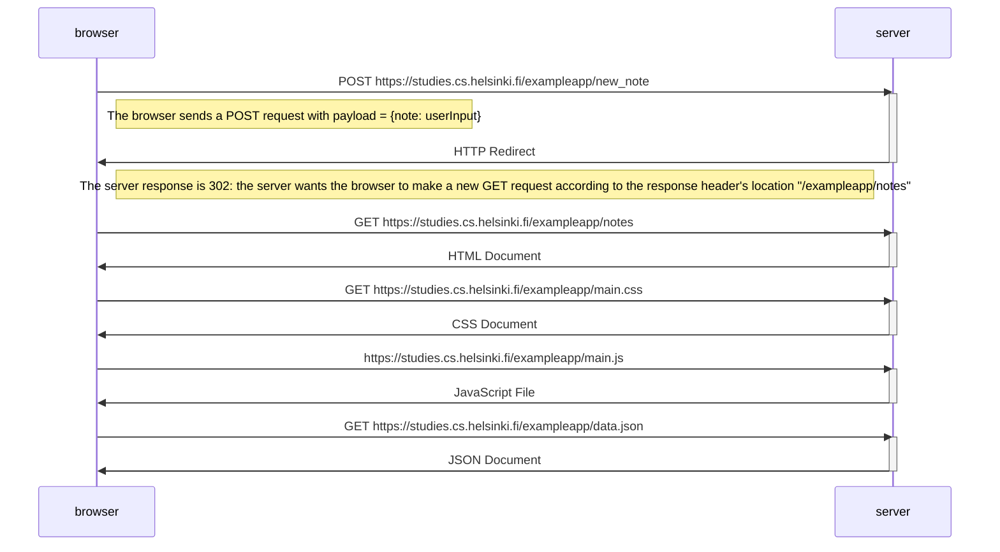

# Exercise 0.4

This is what happens when a user visits the page `https://studies.cs.helsinki.fi/exampleapp/notes` and clicks on the `save` button:

```mermaid
sequenceDiagram
    participant browser
    participant server

    browser->>server: POST https://studies.cs.helsinki.fi/exampleapp/new_note
    activate server
    Note right of browser: The browser sends a POST request with payload = {note: userInput}
    server->>browser: HTTP Redirect
    deactivate server
    Note left of server: The server response is 302: the server wants the browser to make a new GET request according to the response header's location "/exampleapp/notes"

    browser->>server: GET https://studies.cs.helsinki.fi/exampleapp/notes
    activate server
    server->>browser: HTML Document
    deactivate server

    browser->>server: GET https://studies.cs.helsinki.fi/exampleapp/main.css
    activate server
    server->>browser: CSS Document
    deactivate server

    browser->>server: https://studies.cs.helsinki.fi/exampleapp/main.js
    activate server
    server->>browser: JavaScript File
    deactivate server

    browser->>server: GET https://studies.cs.helsinki.fi/exampleapp/data.json
    activate server
    server->>browser: JSON Document
    deactivate server
```