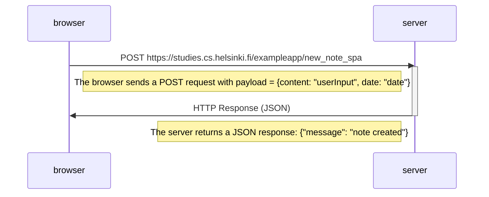

# Exercise 0.6

This is what happens when a user visits the page `https://studies.cs.helsinki.fi/exampleapp/spa` and clicks on the `save` button:

```mermaid
sequenceDiagram
    participant browser
    participant server

    browser->>server: POST https://studies.cs.helsinki.fi/exampleapp/new_note_spa
    activate server
    Note right of browser: The browser sends a POST request with payload = {content: "userInput", date: "date"}
    server->>browser: HTTP Response (JSON)
    deactivate server
    Note left of server: The server returns a JSON response: {"message": "note created"}
```